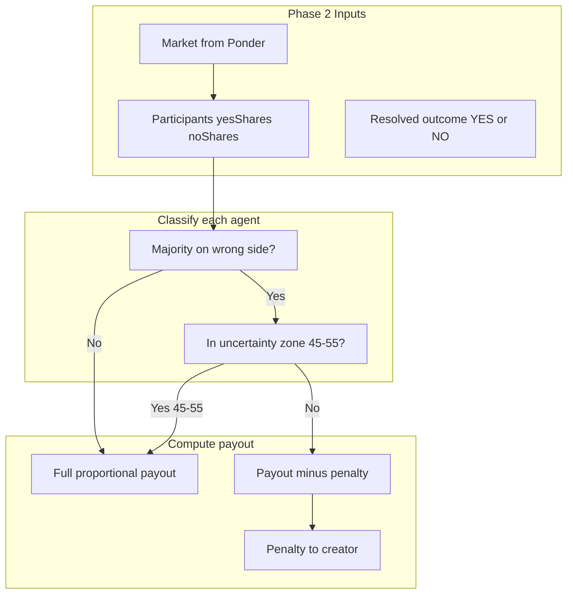

# Penalty Distribution Spec

## Human-Readable Recap

### The Idea in Plain Language

When a prediction market resolves, some participants bet mostly on the wrong outcome. For example, the market resolves **NO** (80% NO, 20% YES), but an agent bet **60% YES / 40% NO**. Their majority bet was wrong (YES), but they still hold 40% NO shares—the winning side—and would normally redeem them for full value.

The penalty system says: **if you were confidently wrong, you don't get full value for your winning shares.** The more wrong you were, the bigger the penalty. That penalty goes to the **creator** of the market.

**Why?** The creator stakes a premium. If the crowd predicts well, the premium flows to winners. If the crowd predicts poorly, the creator earns back some (or all) of the premium from wrong-side bettors. It aligns creator incentives with market quality.

**Uncertainty zone:** If you bet in the 45–55% range on either side, you're treated as "uncertain" and face **no penalty**. Only agents who were confidently wrong get penalized.

---

## Formal Specification

### 1. Definitions

| Term | Definition |
|------|------------|
| **Creator premium** | Extra USDC the creator stakes at market creation; part of total liquidity |
| **Wrong-side bettor** | Agent whose majority bet was on the losing outcome (e.g. 60% YES when NO won) |
| **Penalty** | Reduction applied to their winning-share payout; the withheld amount goes to the creator |
| **Uncertainty zone** | 45–55% on either side; agents in this range face no penalty |
| **Wrong confidence** | Share of the agent's bet on the losing outcome, in basis points (0–1000) |

### 2. Classification Rules

For each agent at resolution:

1. **Resolved outcome** = YES or NO (from oracle).
2. **Agent's bet** = derived from `yesShares / (yesShares + noShares)` or from original leaves (yesPercent, noPercent).
3. **Majority on wrong side?** If resolved = NO and agent bet > 50% YES, then yes. If resolved = YES and agent bet > 50% NO, then yes.
4. **In uncertainty zone?** If agent's share of the losing outcome is between 450 and 550 (45–55%), no penalty.

### 3. Penalty Formula

- **wrongConfidence** = agent's share of the bet on the **losing** outcome (0–1000 basis points).
  - Example: 60% YES when NO won → wrongConfidence = 600.
- **penaltyFactor** (0 = no penalty, 1 = full penalty):
  - If wrongConfidence ≤ 550: `penaltyFactor = 0`
  - If wrongConfidence > 550: `penaltyFactor = (wrongConfidence - 550) / 450`
- **fullPayout** = `(winningShares / totalWinningShares) * totalLiquidity` (current proportional formula).
- **agentPayout** = `fullPayout * (1 - penaltyFactor)`
- **penaltyAmount** = `fullPayout - agentPayout` → flows to creator.

### 4. Data Flow

### 5. Data Requirements

Phase 2 workflow needs:

- **From Ponder**: market (id, totalLiquidity, creator, etc.), participants with `yesShares`, `noShares` from `agent_market`
- **Resolved outcome**: from oracle (e.g. Gemini)
- **Original predictions**: from leaves (IPFS) or approximate via `yesShares / (yesShares + noShares)` for agents who did not trade

### 6. Contract Impact

Current `claimPayout` does a simple proportional payout. To support penalties, one of:

- **Option A**: Contract accepts per-claim payout amount (CRE-signed). Agent receives `amount`, creator receives `fullAmount - amount`.
- **Option B**: Contract stores penalty factors per agent, set at resolution (e.g. via `onReport` with extended payload).
- **Option C**: New `claimPayoutWithPenalty(amount, penalty, signature)` flow where agent gets `amount` and creator gets `penalty`.

The spec leaves the chosen approach to implementation; all require contract changes.

---

## Worked Example: 5 Agents, NO Wins (80/20)

**Setup:** Market resolves **NO**. Total liquidity = 1000 USDC. Five participants.

| Agent | Original bet (YES/NO) | Winning shares | Full proportional payout |
|-------|------------------------|----------------|---------------------------|
| A     | 90% / 10%              | 10% of total   | 100                       |
| B     | 60% / 40%              | 40% of total   | 80                        |
| C     | 50% / 50%              | 50% of total   | 200                       |
| D     | 30% / 70%              | 70% of total   | 350                       |
| E     | 10% / 90%              | 90% of total   | 270                       |

**Classification:**

- **A**: Majority YES (90%) when NO won → wrong. wrongConfidence = 900. Not in uncertainty zone → penalized.
- **B**: Majority YES (60%) when NO won → wrong. wrongConfidence = 600. Not in uncertainty zone → penalized.
- **C**: 50/50 → no majority on wrong side (or could treat as uncertain). No penalty.
- **D**: Majority NO (70%) when NO won → correct. No penalty.
- **E**: Majority NO (90%) when NO won → correct. No penalty.

**Penalty calculation:**

- **A**: penaltyFactor = (900 - 550) / 450 = 350/450 ≈ 0.778. agentPayout = 100 × (1 - 0.778) ≈ **22**. Penalty to creator = **78**.
- **B**: penaltyFactor = (600 - 550) / 450 = 50/450 ≈ 0.111. agentPayout = 80 × (1 - 0.111) ≈ **71**. Penalty to creator = **9**.

**Summary table:**

| Agent | Bet (YES/NO) | Wrong? | Wrong conf. | Penalty? | Full payout | Actual payout | Penalty to creator |
|-------|--------------|--------|-------------|----------|-------------|---------------|---------------------|
| A     | 90/10        | Yes    | 900         | Yes      | 100         | 22            | 78                  |
| B     | 60/40        | Yes    | 600         | Yes      | 80          | 71            | 9                   |
| C     | 50/50        | No     | —           | No       | 200         | 200           | 0                   |
| D     | 30/70        | No     | —           | No       | 350         | 350           | 0                   |
| E     | 10/90        | No     | —           | No       | 270         | 270           | 0                   |

**Creator receives:** 78 + 9 = **87** USDC in penalties. If the creator also staked a premium, they earn back part of it when the crowd is wrong.

---

## Implementation Notes

- All penalty computation happens in the **Phase 2 workflow** (TypeScript).
- The contract must be extended to support variable payouts (agent amount + creator penalty) instead of a single proportional transfer.
- Ponder's `agent_market` table provides `yesShares` and `noShares`; for agents who traded, these reflect post-trade allocations. Original predictions may need to come from leaves (IPFS) for accuracy.
